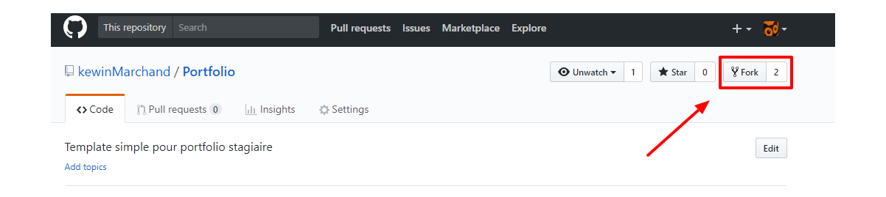
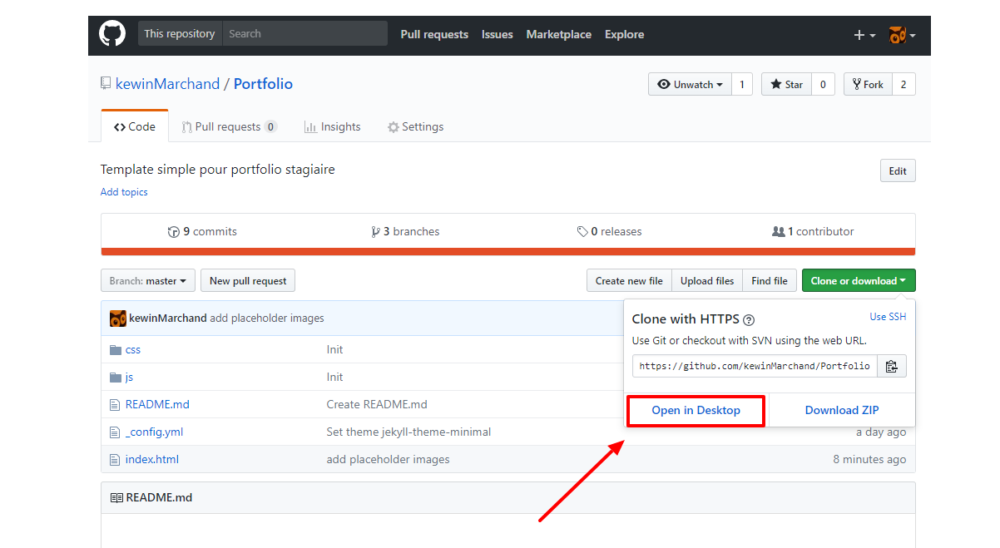
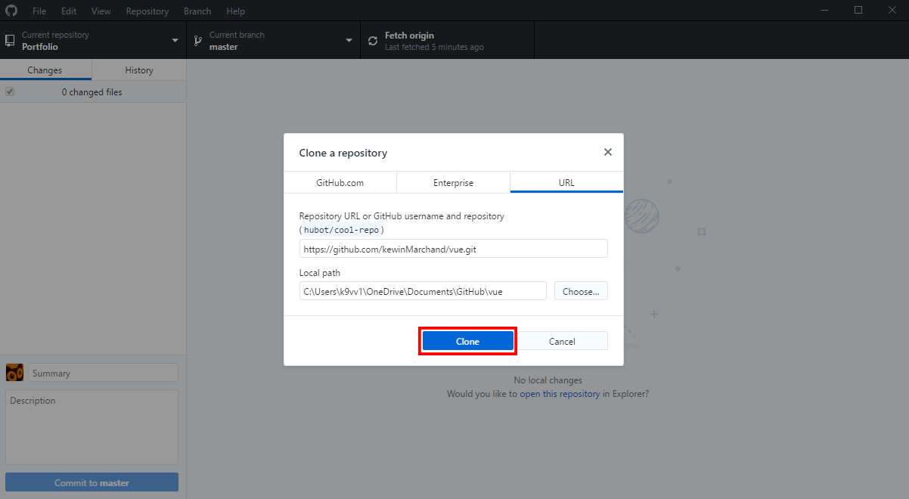
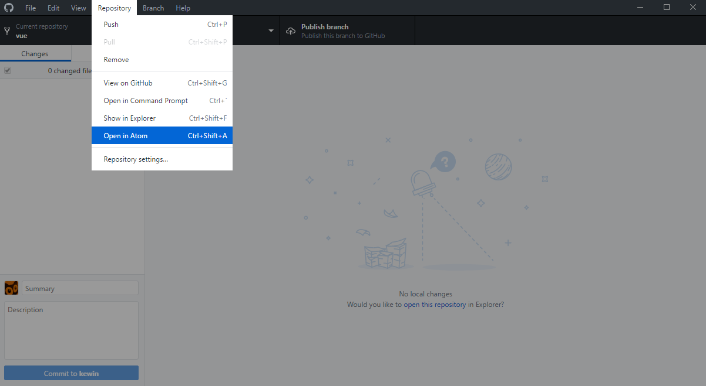
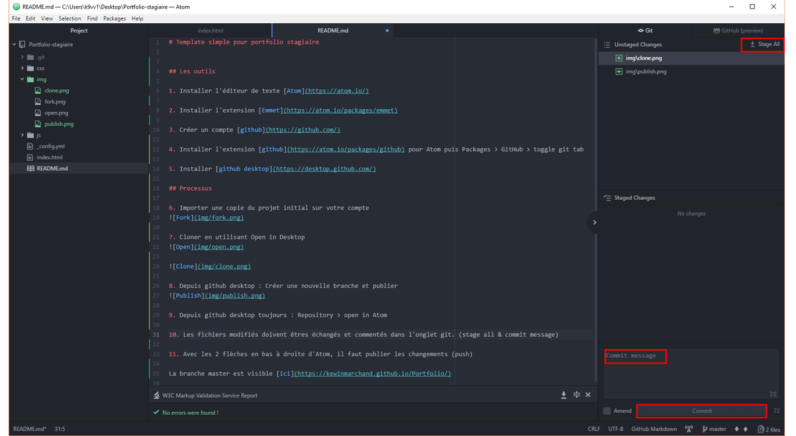
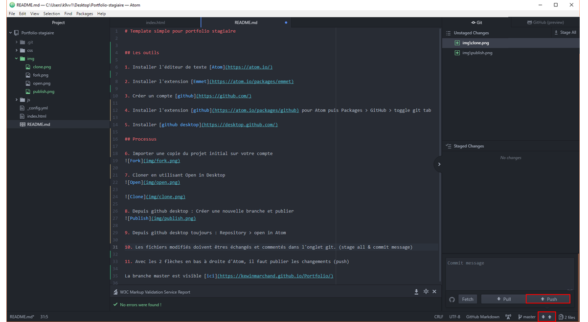

# Template simple pour portfolio stagiaire

## Les outils

1. Créer un compte [github](https://github.com)

2. Installer [github desktop](https://desktop.github.com/)

3. Installer l'éditeur de texte [Atom](https://atom.io/)

4. Depuis Atom, installer l'extension [Emmet](https://atom.io/packages/emmet)

5. Installer aussi l'extension [github](https://atom.io/packages/github)

6. Dans Atom toujours ouvrir l'onglet github (Packages > GitHub > toggle git tab)

## Processus

1. Dans github, importer une copie du projet portfolio initial sur votre compte (fork)

2. Cloner en utilisant Open in Desktop

4. Depuis github desktop : Repository > open in Atom

5. A partir de maintenant, vous pouvez travailler sur la branche "gh-pages" du projet.

Elle est accessible en ligne à l'adresse : https://[votre ID github].github.io/Portfolio-HTML/.

A vous de créer le(s) fichiers css correspondants à votre maquette.

Les fichiers modifiés doivent êtres échangés et commentés dans l'onglet git. (stage all & commit message)

Avec les 2 flèches en bas à droite d'Atom, il faut publier les changements (push)

En installant livestyle d'emmet ([package Atom](https://atom.io/packages/livestyle-atom) + [plugin chrome](https://chrome.google.com/webstore/detail/emmet-livestyle/diebikgmpmeppiilkaijjbdgciafajmg), vous pouvez voir vos modifications CSS en direct avant d'échanger les fichiers.

Un exemple de mise en page est visible [ici](https://kewinmarchand.github.io/Portfolio-CSS/)
